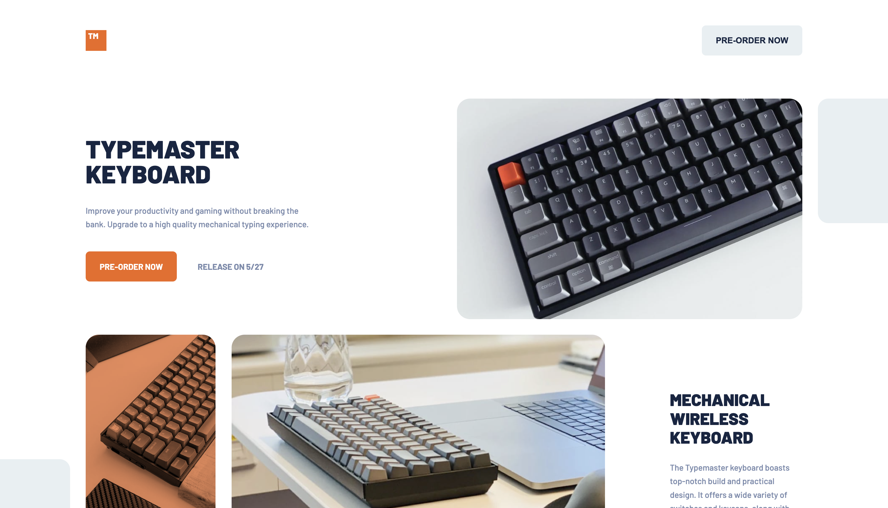
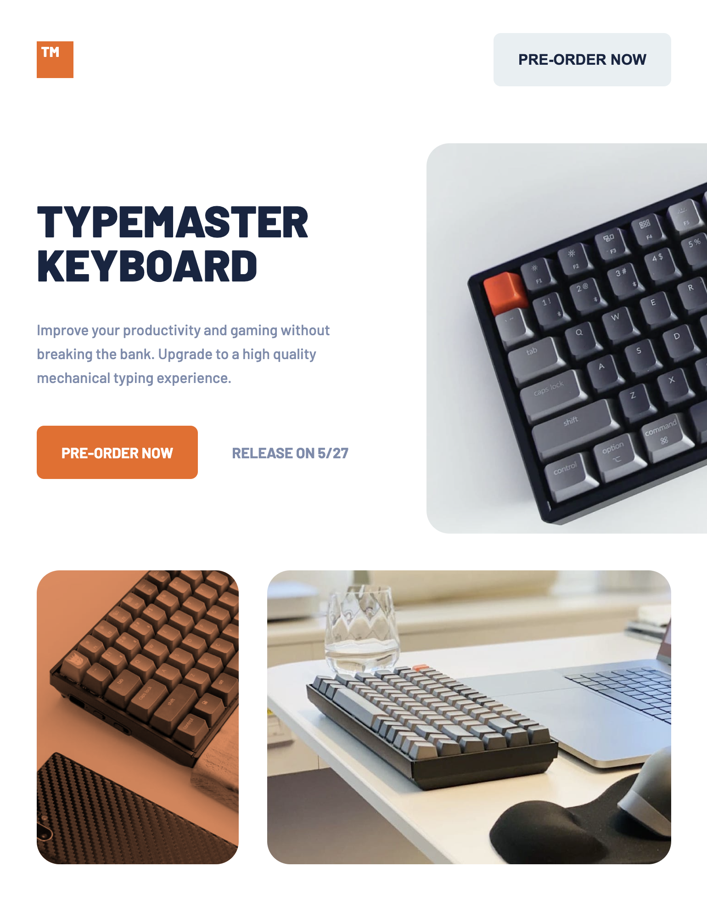
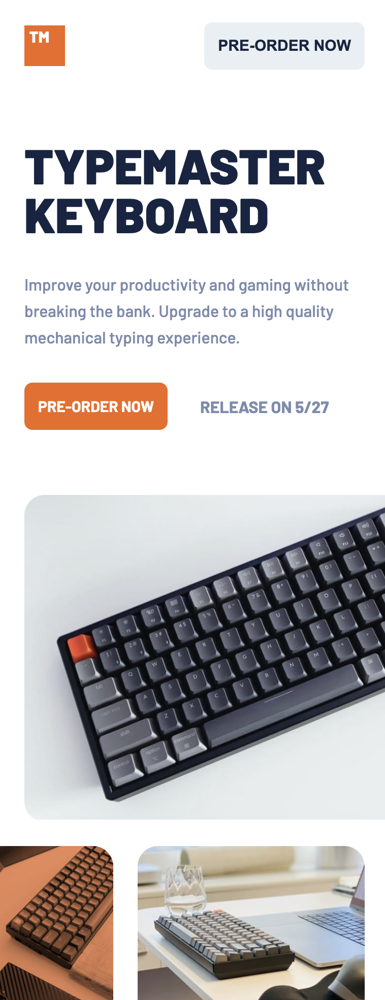

# TypeMaster Pre-Launch Landing Page

  
  
  
  

   
   

  
  
  

---

## About The Project

This is a responsive landing page for **"TypeMaster"**, a high-quality mechanical keyboard pre-launch campaign. The project focuses on a sleek, gaming-oriented UI with a **mobile-first** approach, ensuring the layout transitions smoothly from mobile phones to tablets and large desktop screens.

It demonstrates the use of semantic HTML5, advanced CSS layout techniques (CSS Grid & Flexbox), and SCSS nesting syntax for maintainable styling.

### Key Features

- **Mobile-First Workflow:** Styles are written for mobile first, then expanded for larger screens using min-width media queries (`768px` and `1440px`).
- **Semantic HTML:** Proper use of landmarks like `<header>`, `<main>`, `<section>`, and `<footer>` for accessibility.
- **Responsive Images:** Usage of the `<picture>` tag to serve optimized image sizes and crops for different devices.
- **Advanced CSS:** Implementation of CSS Grid for complex layouts and `mix-blend-mode` for creative image overlays without external editing.
- **Custom Properties:** Usage of CSS variables for consistent color theming and spacing.

---

## Screenshots

 
  <h3>Desktop View</h3>
  

 

  

    <h3>Tablet View</h3>
    
  

  

    <h3>Mobile View</h3>
    
  

---

## Built With

- **[HTML5](https://developer.mozilla.org/en-US/docs/Web/HTML)** - Semantic structure and `<picture>` element usage.
- **[SCSS / SASS](https://sass-lang.com/)** - Utilized nesting syntax and variables for cleaner stylesheets.
- **[CSS Grid](https://developer.mozilla.org/en-US/docs/Web/CSS/CSS_Grid_Layout)** - Used for the main layout structure and image galleries.
- **[Flexbox](https://developer.mozilla.org/en-US/docs/Web/CSS/CSS_Flexible_Box_Layout)** - Used for component alignment and spacing.
